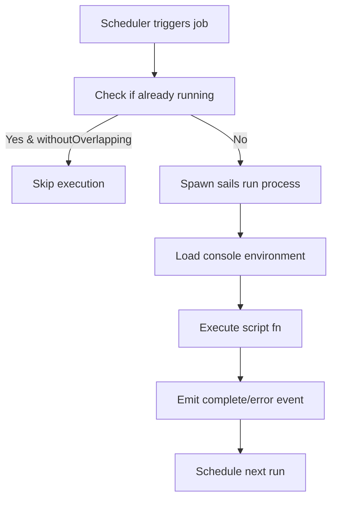

# How Quest Works

This page explains the technical architecture of Quest, our design decisions, and what we built upon to create a native job scheduling solution for Sails.js.

## The Core Challenge

When building a job scheduler for Sails.js, we faced a fundamental challenge: How do you run scheduled code with full access to Sails models, helpers, and services?

Most JavaScript job schedulers (like Bree) use worker threads for isolation and stability. However, worker threads run in a completely separate context - they can't access your Sails app's models or helpers. You'd need complex message passing between threads, which creates a terrible developer experience.

## Our Solution: Process-Based Isolation

Quest takes a different approach inspired by how Sails itself works:

```javascript
// Instead of worker threads, we spawn a new process
spawn('./node_modules/.bin/sails', ['run', 'cleanup-sessions'], {
  env: { NODE_ENV: 'console' }
})
```

This gives us:

- **Full Sails context** - Models, helpers, and services work normally
- **Process isolation** - Jobs can't crash your main app
- **Memory safety** - Each job gets fresh memory, no leaks accumulate
- **Familiar patterns** - It's just `sails run` under the hood

## The Console Environment

Quest jobs run in a special `console` environment that's optimized for background tasks:

```javascript
// config/env/console.js
module.exports = {
  hooks: {
    views: false, // No view engine needed
    sockets: false, // No WebSocket server
    pubsub: false, // No pub/sub for sockets
    shipwright: false, // No asset compilation
    session: false // No session management
  }
}
```

This minimal Sails lift:

- Starts up faster (important for frequent jobs)
- Uses less memory
- Avoids port conflicts (no HTTP server)
- Loads only what jobs need (models and services)

## Scheduling Engine

Quest combines three battle-tested libraries for maximum flexibility:

### 1. Cron Expressions (cron-parser)

```javascript
const { CronExpressionParser } = require('cron-parser')
// Handles: '0 2 * * *' (2 AM daily)
```

Traditional cron syntax for precise scheduling, validated and parsed reliably.

### 2. Human Intervals (human-interval)

```javascript
const humanInterval = require('human-interval')
// Handles: '30 minutes', '2 hours', '3 days'
```

Simple duration parsing for interval-based jobs.

### 3. Natural Language (@breejs/later)

```javascript
const later = require('@breejs/later')
// Handles: 'every 5 minutes', 'at 5:00 pm', 'on the last day of the month'
```

Later.js's powerful text parser for complex schedules in plain English.

## Execution Flow

Here's what happens when a job runs:



### Step-by-Step:

1. **Scheduler calculates next run time** based on cron/interval
2. **Timer fires** at the scheduled time
3. **Quest checks** if job is paused or already running
4. **Spawns process** with `sails run scriptname --inputs`
5. **Console environment** loads minimal Sails
6. **Script executes** with full model/helper access
7. **Process exits** cleanly after completion
8. **Events emit** for monitoring/alerting
9. **Next run scheduled** automatically

## Design Influences

### From Bree

- Clean job definition structure
- Friendly scheduling API
- Worker-based isolation concept (adapted to processes)

### From node-cron

- Simple cron expression support
- Lightweight scheduling approach

### From Laravel's Task Scheduler

- Overlap prevention concept (`withoutOverlapping`) - though we default it to true unlike Laravel
- Fluent scheduling API
- Environment-based configuration

### From Sails Scripts

- Actions2 format for job definitions
- Input validation and defaults
- Async/await patterns

## Key Design Decisions

### Preventing Overlaps by Default

Unlike Laravel (which allows overlaps unless you add `->withoutOverlapping()`), Quest prevents job overlaps by default. This is a deliberate safety choice:

```javascript
// Laravel - overlaps allowed by default
Schedule::command('cleanup')->everyMinute(); // Can run multiple times!
Schedule::command('cleanup')->everyMinute()->withoutOverlapping(); // Must opt-in

// Quest - overlaps prevented by default
quest: {
  interval: '1 minute'  // Won't run if previous is still running
}

quest: {
  interval: '1 minute',
  withoutOverlapping: false  // Must explicitly opt-out
}
```

Why this default?

- **Prevents common mistakes** like duplicate charges or double-processing
- **Most jobs shouldn't overlap** (backups, reports, cleanup)
- **Explicit opt-out** makes dangerous behavior obvious
- **Follows Bree's safety-first approach**

### Database-Free Scheduling, Database-Backed State

Following Bree's philosophy, Quest doesn't require Redis or MongoDB for the scheduler itself. As Bree's documentation states: "Bree does not force you to use an additional database layer of Redis or MongoDB to manage job state."

Instead:

- **Scheduler state** is in-memory (which jobs are running)
- **Business state** is in your database (which emails were sent)

For example:

```javascript
// Good: Job checks database for what needs processing
module.exports = {
  friendlyName: 'Process pending orders',

  quest: {
    interval: '5 minutes'
    // withoutOverlapping: true (default - prevents concurrent runs)
  },

  fn: async function () {
    // Database tells us what needs processing
    const orders = await Order.find({
      status: 'pending',
      processedAt: null // Database state prevents reprocessing
    }).limit(10)

    for (const order of orders) {
      await processOrder(order)

      // Update database state
      await Order.updateOne({ id: order.id }).set({
        status: 'processed',
        processedAt: new Date()
      })
    }

    return { processed: orders.length }
  }
}
```

This pattern:

- **Survives restarts** - Database state persists
- **Prevents duplicates** - Through your data model, not the scheduler
- **Scales horizontally** - Multiple servers can check the same database
- **Keeps Quest simple** - No job history tables or state management

### Why Not Worker Threads?

Worker threads seem perfect for jobs - they're isolated, efficient, and built into Node.js. But they have a fatal flaw for Sails apps:

```javascript
// In a worker thread, this fails:
const users = await User.find() // User is undefined!
```

Workers can't access the main thread's context. We'd need to:

1. Serialize all data for the worker
2. Re-initialize Sails inside each worker
3. Handle complex message passing

This creates complexity without benefits.

### Why Not Run in Main Thread?

Running jobs in the main thread (like node-cron) seems simpler:

```javascript
// This works but is dangerous:
setInterval(async () => {
  await heavyJob() // Could block your server!
}, 60000)
```

Problems:

- Long jobs block HTTP requests
- Memory leaks accumulate
- Errors can crash your server
- No clean restart per job

### Why Processes?

Processes give us the best of both worlds:

```javascript
// Each job runs in isolation with full Sails context
spawn('sails', ['run', 'job-name', '--key=value'])
```

### How Inputs Are Passed

Quest properly formats inputs for the `sails run` command exactly as you'd type them:

```javascript
// When you define inputs with defaults
inputs: {
  template: {
    type: 'string',
    defaultsTo: 'standard'
  },
  limit: {
    type: 'number',
    defaultsTo: 100
  }
}

// Quest executes the exact command you'd run manually:
sails run send-emails --template="alternative" --limit=50
```

This means:

- Inputs work identically to manual `sails run` execution
- Default values are used when inputs aren't provided
- You can test jobs manually before scheduling them:

```bash
# Test manually first
sails run cleanup-sessions --daysOld=7 --dryRun=true

# Then schedule with confidence
quest: { interval: '1 day' }
inputs: { daysOld: 7, dryRun: false }
```

Benefits:

- Complete Sails context access
- True isolation from main app
- Clean memory per execution
- Familiar `sails run` semantics
- Can be tested independently

## File Structure

Quest expects this structure:

```
your-sails-app/
├── config/
│   ├── quest.js           # Quest configuration
│   └── env/
│       └── console.js     # Console environment
├── scripts/               # Job scripts
│   ├── cleanup.js
│   ├── backup.js
│   └── send-emails.js
└── node_modules/
    └── sails-hook-quest/  # The Quest hook
```

## Performance Considerations

### Startup Overhead

Each job spawns a new Sails process. While the console environment is minimal, there's still startup time:

- **Console environment**: ~500-800ms startup
- **Full environment**: ~2-5s startup

This is why we default to console mode and disable unnecessary hooks.

### Memory Usage

Each job process uses:

- **Base Node.js**: ~30MB
- **Minimal Sails**: ~50-80MB total
- **With your models/services**: ~80-150MB

Memory is released completely when the job finishes.

### Concurrent Jobs

Since jobs run in separate processes, they can run in parallel without blocking each other:

```javascript
// These run simultaneously in different processes
await sails.quest.run(['backup-db', 'send-emails', 'generate-report'])
```

## Monitoring & Observability

Quest emits events at key points:

```javascript
sails.on('quest:job:start', (data) => {
  // Job started - log to monitoring service
})

sails.on('quest:job:complete', (data) => {
  // Job finished - track duration metrics
})

sails.on('quest:job:error', (data) => {
  // Job failed - send alerts
})
```

This event-driven architecture allows integration with any monitoring stack without Quest needing to know about specific services.

## Comparison with Alternatives

| Feature               | Quest   | Bree       | node-cron | Bull       |
| --------------------- | ------- | ---------- | --------- | ---------- |
| Sails context         | ✅ Full | ❌ None    | ✅ Full   | ❌ None    |
| Process isolation     | ✅ Yes  | ✅ Workers | ❌ No     | ✅ Workers |
| Prevents overlapping  | ✅ Yes  | ✅ Yes     | ❌ No     | ✅ Yes     |
| Human-readable times  | ✅ Yes  | ✅ Yes     | ❌ No     | ❌ No      |
| External dependencies | ❌ None | ❌ None    | ❌ None   | ✅ Redis   |
| Memory safety         | ✅ Yes  | ✅ Yes     | ❌ No     | ✅ Yes     |

## Future Considerations

While Quest is production-ready, we're considering these enhancements:

1. **Job History**: Persist execution history to database
2. **Distributed Execution**: Ensure only one instance runs jobs in multi-server deployments
3. **Job Chaining**: Define job dependencies and workflows
4. **Retries**: Automatic retry with exponential backoff
5. **Metrics Collection**: Built-in performance metrics

## Contributing

Understanding Quest's architecture helps you contribute effectively:

- **Scheduler logic**: `lib/index.js` - job scheduling and lifecycle
- **Process spawning**: `executeJob()` function - how jobs run
- **Schedule parsing**: `calculateNextRun()` - handles cron/interval/human formats
- **Event emission**: Throughout execution for extensibility

The codebase is intentionally simple - one main file that orchestrates scheduling and execution, leveraging Sails' existing script infrastructure.

## Summary

Quest is built on a simple insight: Sails already knows how to run scripts with `sails run`. By combining this with robust scheduling libraries and process isolation, we get a job scheduler that feels native to Sails while providing production-grade reliability.

The architecture prioritizes:

1. **Developer experience** - Jobs are just Sails scripts
2. **Reliability** - Process isolation prevents cascading failures
3. **Flexibility** - Multiple scheduling formats for different needs
4. **Simplicity** - No external dependencies or complex setup

This design makes Quest a natural extension of Sails rather than a foreign addition.
